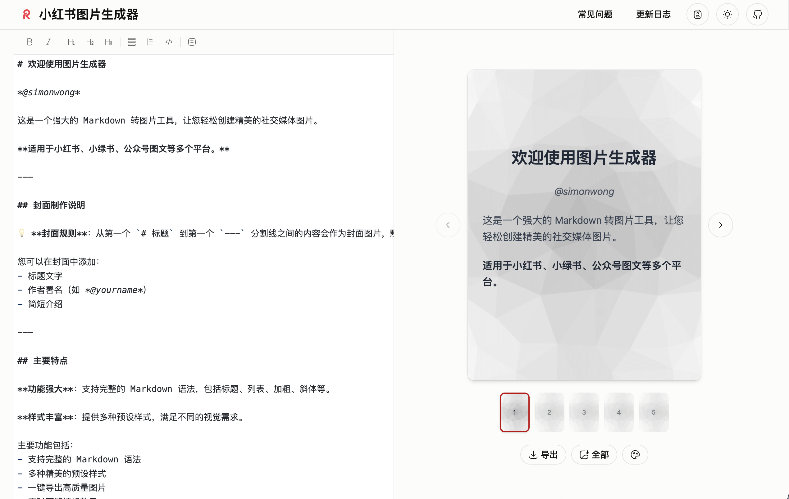
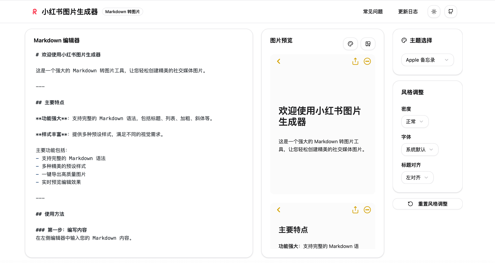
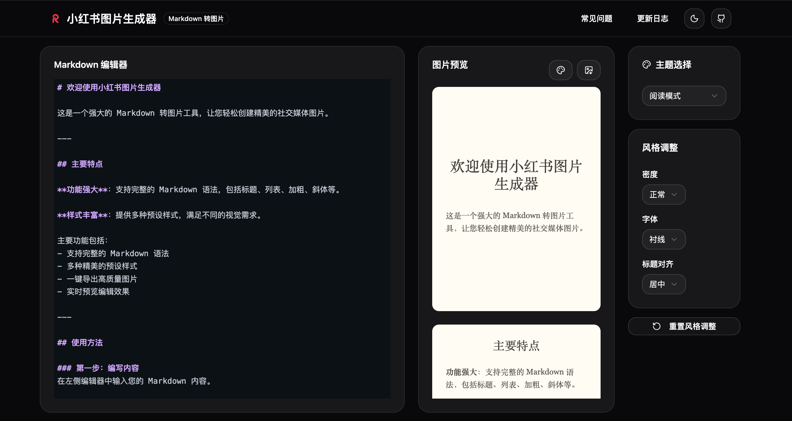

# 小红书图片生成器

免费将 Markdown 文字转成小红书风格图片，多种精美主题模板，支持批量导出高清图。

**在线体验：** [https://redbook-text2img.site/](https://redbook-text2img.site/)





## 功能特点

- **Markdown 支持**：完整支持标题、粗体、斜体、列表、引用等常用语法
- **精美主题**：内置多种精心设计的主题模板，一键切换
- **实时预览**：编辑即可看到效果，所见即所得
- **批量导出**：长内容自动分页，支持一键批量导出所有图片
- **隐私安全**：纯前端实现，数据本地处理，不上传服务器
- **免费使用**：完全免费，无需注册

## 本地开发

```bash
# 安装依赖
bun install

# 启动开发服务器
bun dev

# 构建生产版本
bun build
```

## 技术栈

- [Next.js](https://nextjs.org/) - React 框架
- [Tailwind CSS](https://tailwindcss.com/) - 样式
- [CodeMirror](https://codemirror.net/) - Markdown 编辑器
- [html2canvas](https://html2canvas.hertzen.com/) - 图片导出

## 背景素材来源

- [BGJar](https://bgjar.com/)
- [Cool Backgrounds](https://coolbackgrounds.io/white-background/)
- [Mesh Gradient](https://meshgradient.in/)

## 联系作者

- Twitter: [@simonwongio](https://x.com/simonwongio)
- GitHub: [@simonwong](https://github.com/simonwong)

## License

MIT
