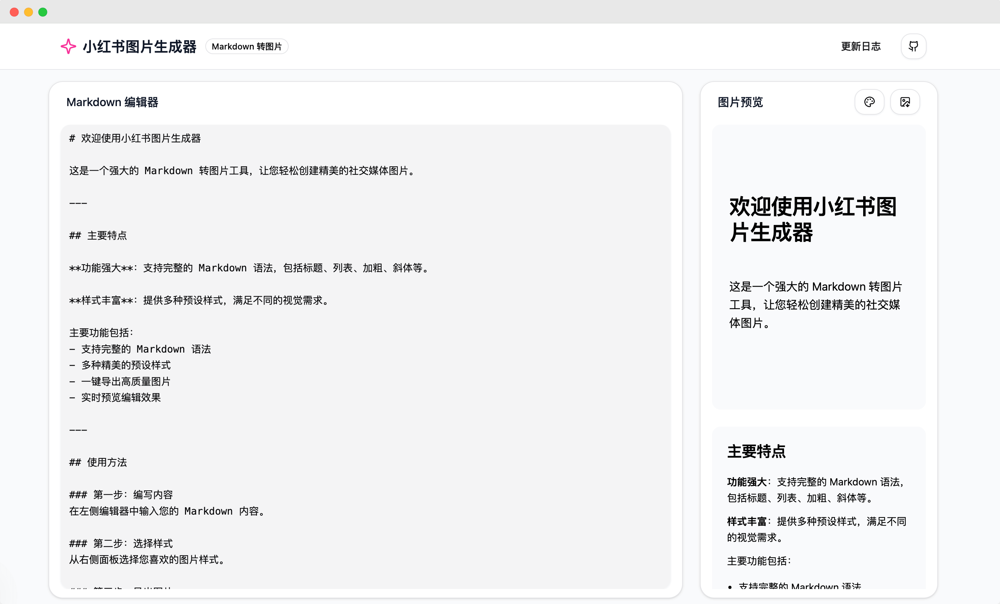

# 小红书 Markdown 转 图片

在线 Markdown 转换为小红书图片的工具。内置了一些风格样式，也可以轻量的自定义样式。

## 风格来源

### 样式参考

- <https://github.com/tailwindlabs/tailwindcss-typography/blob/main/src/styles.js>

### 图片背景生成来源

- <https://bgjar.com/>
- <https://coolbackgrounds.io/white-background/>
- <https://meshgradient.in/>
